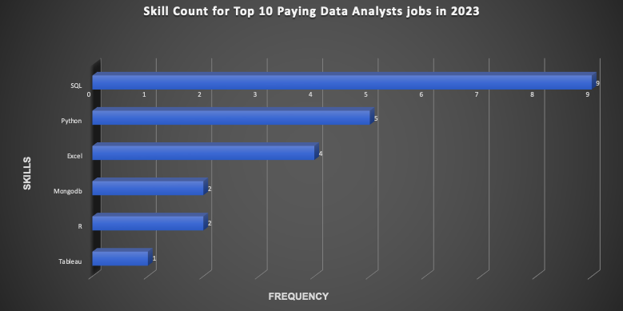

# Introduction
Dive into the world of job market analysis, with a particular focus on data analyst roles. This project aims to uncover lucrative job opportunities, identify in-demand skills, and pinpoint where high demand coincides with attractive salaries within the realm of data analytics. 

SQL queries? check them out here: [project_sql folder](/project_sql/)

# Background
Driven by a quest to navigate the data analyst job market more effectively, this project was born from a desire to pin-point top-paid and in-demand skills, streamlining others work to find optimal jobs.

Data hails from my [SQL course](https://lukebarousse.com/sql). It's packed with insights on job titles, salaries, location and essential skills.

### The queations I wanted to answer through my SQL queries were:

1. What are the top-paying data analyst jobs?
2. What skills are required to obtain these top-paying jobs?
3. What skills are the most in demand for data analysts? 
4. Which skills are associated with higher salaries?
5. What are the most optimal skills to learn?

# Tools I used 
For my deep dive into the data analyst job market, I harnssed the power of several key tools:

- **SQL**: The backbone of my analysis, allowing me to query the database and unearth ritical insights.
- **PostgreSQL**: The chosen database management, ideal for handling the jobposting data.
- **Visual Studio Code**: My go-to for database management and executing SQL queries.
- **Git and GitHub**: Essential for version control and sharing my SQL scripts and analysis, ensuring collabration and project tracking.   

# The Analysis 
Each query for this project aimed at investigating specific aspects of data analyst job market. Here's how I approached each question :

### 1. Top Paying Data Analyst Jobs
 To identify the highest-paying roles, I filtered data analyst positions by location  and average yearly salary, focusing on jobs in the UK. This query highlights the high paying opportunities in the field.

```sql
 SELECT
    skills_dim.skill_id,
    skills_dim.skills,
    COUNT(skills_job_dim.job_id) AS demnad_count,
    ROUND(AVG(job_postings_fact.salary_year_avg), 0) AS avg_salary 
FROM job_postings_fact
INNER JOIN skills_job_dim ON job_postings_fact.job_id =  skills_job_dim.job_id
INNER JOIN skills_dim ON skills_job_dim.skill_id = skills_dim.skill_id
WHERE
    job_title_short = 'Data Analyst'
    AND salary_year_avg IS NOT NULL
    AND RIGHT(job_location, 4) = ', UK'
GROUP BY 
    skills_dim.skill_id
HAVING
    COUNT(skills_job_dim.job_id) > 10
ORDER BY 
    avg_salary DESC,
    demnad_count DESC
LIMIT 10;
```

Here's the breakdown of the top data analyst jobs in 2023:
- **Wide salary range:** The top 10 paying data analyst roles in the UK span from £111,175 to £177,283, indicating significant salary potential within the field. Across the nation, there were a total of 50 job openings. Notably, even the lowest salary offered, at £51,014, surpasses the average salary in the UK.
- **Diverse Employers:** Companies such as DeepMind, AJ Bell, Sylvera, and Ocorion are among the top organizations offering high salaries, indicating a widespread interest from companies across various industries.
- **Job Title Variety:** There is a high diversity in job titles, ranging from Data Architect to Data Analyst, reflecting the varied roles and specialisations within the field of data analytics.

### 2. Skills For Top Paying Jobs
To understand what skills are required for top-paying jobs, I joined the job postings with the skill data, providing insights into what employers value for high-compensation roles.
```sql
WITH Highest_paying_datajobs AS(
    SELECT 
        job_id,
        job_title,
        name AS Company_name,
        salary_year_avg
    FROM
        job_postings_fact
    LEFT JOIN company_dim ON job_postings_fact.company_id = company_dim.company_id 
    WHERE job_title_short = 'Data Analyst' AND  
        RIGHT(job_location, 4) = ', UK' AND
        salary_year_avg IS NOT NULL 
    ORDER BY 
        salary_year_avg DESC
    LIMIT 10
)

SELECT 
Highest_paying_datajobs.*,
skills_dim.skills
FROM Highest_paying_datajobs
INNER JOIN skills_job_dim AS skills_to_job ON Highest_paying_datajobs.job_id = skills_to_job.job_id
INNER JOIN skills_dim ON skills_to_job.skill_id = skills_dim.skill_id
--WHERE skills_dim.skills = 'sql'-- to go further to get only jobs that require SQL 
ORDER BY Highest_paying_datajobs.salary_year_avg DESC
```
Here's the breakdown of the most demanded skills for the highest paying data analyst jobs:
- **SQL** is leading with a bold count of 9
- **Python** is second with a bold count of 5
- **Excel**  is also highly sought after with a bold count of 4 and other skills like **Mongodb**, **Tableau**, **R** and **Pandas** show varying degrees of demand. 


*Bar graph visualizing the top skills for data analysts; Created on Excel with the results of my SQL query results*


### 3. In-Demand Skills For Data Analysts
This query helped identify the skills most frequently requested in job postings, directinf focus to areas with high demand. 
```sql
SELECT 
    skills,
    COUNT(skills_to_job.job_id) AS demnad_count
FROM job_postings_fact
INNER JOIN skills_job_dim AS skills_to_job ON job_postings_fact.job_id = skills_to_job.job_id
INNER JOIN skills_dim ON skills_to_job.skill_id = skills_dim.skill_id
WHERE
    job_title_short = 'Data Analyst' AND
    RIGHT(job_location, 4) = ', UK'
    GROUP BY
    skills
ORDER BY demnad_count DESC
LIMIT 5;
 ```
Here's the breakdown of the most demanded skills for data analysts in 2023
- **EXCEL** and **SQL** remain fundamental, emphazing the need for strong foundational skillsin data processing and spreadsheet manipulation.

- **Programming** and **Visualisation Tools** like **Power bi**, **Python** and **Tableau** are essential, pointing towards the increasing importance of techinical skills in data storytelling and decision support. 

| **Skills**   | **Demand Count** |
|--------------|------------------|
| Excel        |       3068       |
| SQL          |       3067       |
| Power bi     |       2008       |
| Python       |       1380       |
| Tableau      |       1075       |

  *Table of the Demand for the top 5 Skills in data analyst job postings*


### 4. Skills Based on Salary

Exploring the average salaries associated with different skills revealed which skills are the highest paying.
```sql
SELECT 
    skills,
    ROUND(AVG(salary_year_avg), 0)AS avg_salary
FROM job_postings_fact
INNER JOIN skills_job_dim AS skills_to_job ON job_postings_fact.job_id = skills_to_job.job_id
INNER JOIN skills_dim ON skills_to_job.skill_id = skills_dim.skill_id
WHERE
    job_title_short = 'Data Analyst' AND
    salary_year_avg IS NOT NULL AND
    RIGHT(job_location, 4) = ', UK'
    GROUP BY
    skills
ORDER BY avg_salary DESC
LIMIT 25;
```
Here's a breakdown of the results for top paying skills for Data Analysts.

- **High Demand for Big Data & ML Skills**: Top salaries are commanded by analysts proficient in big data technologies (PySpark), machine learning tools (PyTorch ,TensorFlow), and Python libraries (Pandas ,NumPy). These trends reflect the industry's significant valuation of data processing and predictive modelling capabilities.

- **Software Development & Development Proficiency**: Proficiency in development and deployment tools such as C++, MongoDB, and Kafka indicates a lucrative crossover between data analysis and engineering. These are premium skills that facilitate automation and efficient data pipeline management, highlighting the intersection of analytical expertise with technological acumen.

- **Cloud Computing Expertise**: Familiarity with cloud and data engineering tools like Elasticsearch and Aurora underscores the growing importance of cloud-based analytics environments. This suggests that proficiency in cloud technologies significantly enhances earning potential in the field of data analytics.

| **Skills**    | **Average_Salary** |
|---------------|--------------------|
| Tensorflow    |      177,283       |
| NumPy         |      177,283       |
| PyTorch       |      177,283       |
| Pandas        |      177,283       |
| C++           |      177,283       |
| Elasticsearch |      165,000       |
| Mongodb       |      165,000       |
| Aurora        |      165,000       |
| Kafka         |      165,000       |
| Postgressql   |      165,000       |

### 5. Most Optimal Skills to Learn
Combining insights from demand and salary data, this query aimed to pinpoint skills that are both in high demand and have salaries, offering strategic focus for skill development. 
```sql
SELECT
    skills_dim.skill_id,
    skills_dim.skills,
    COUNT(skills_job_dim.job_id) AS demnad_count,
    ROUND(AVG(job_postings_fact.salary_year_avg), 0) AS avg_salary 
FROM job_postings_fact
INNER JOIN skills_job_dim ON job_postings_fact.job_id =  skills_job_dim.job_id
INNER JOIN skills_dim ON skills_job_dim.skill_id = skills_dim.skill_id
WHERE
    job_title_short = 'Data Analyst'
    AND salary_year_avg IS NOT NULL
    AND RIGHT(job_location, 4) = ', UK'
GROUP BY 
    skills_dim.skill_id
HAVING
    COUNT(skills_job_dim.job_id) > 10
ORDER BY 
    avg_salary DESC,
    demnad_count DESC
```
| **Skill_id** | **Skills** |  **Demand Count** | **Avg_Salary** |
|--------------|------------|-------------------|----------------|       
| 1            |   Python   |        16         |    96,619       |
| 0            |    SQL     |        25         |    93,985       |
| 181          |    Excel   |        18         |    83,892       | 
  
  *Table of the most optimal skills for data analysts sorted by salary*

- **High-Demand programming languages and Database Technologies**: **Python** stands out for its high salary, commanding an average of £96,619. Despite its lucrative compensation, the demand for this skill was 16, compared to **SQL**, which had the highest demand count of 25 among all the skills available. SQL boasted a salary very close to Python, averaging £93,985. On the other hand, **Excel** had a demand count higher than Python, with 18, but offered a lower average salary of £83,892. These figures indicate that proficiency in Python and SQL is highly valued, yet also widely available

# What I learned 
 
 Throughout the process of completing this project, I have acquired a set of skills that have significantly expanded my proficiency with the SQL toolkit:

1.**Complex Query Crafting**: I have mastered advanced SQL techniques such as subqueries, Common Table Expressions (CTEs), and various types of joins. This has broadened my understanding of SQL's capabilities and enriched my ability to handle complex data scenarios. Additionally, I have gained a deeper insight into the nuanced application of functions like COUNT() and AVG().

2.**Table Merging**: This project marked my introduction to table merging, a fundamental aspect of data analysis. I have gained practical experience in merging tables efficiently and effectively, leveraging techniques such as the use of 'WITH' clauses to streamline the process.

3.**Real-World Problem Solving**: One of the most valuable skills I have honed is the ability to translate real-world questions and challenges into actionable and insightful SQL queries. Through tackling various scenarios and data sets, I have developed a keen aptitude for problem-solving within the context of data analysis, enabling me to derive meaningful insights and recommendations from raw data.

Overall, this project has been instrumental in my professional development, equipping me with a robust set of SQL skills and problem-solving abilities that are invaluable assets in the field of data analytics.


# Conclusion 
### Insights

1. **Top-Paying Data Analyst Jobs**: The highest-paying jobs for data analysts in the UK offer a wide range of salaries, with the highest reaching £177,283.
2. **Skills for Top-Paying Jobs**: High-paying data analyst roles require advanced proficiency in SQL, suggesting it is a critical skill for earning a top salary.
3. **Most In-Demand Skills**: Excel and SQL are the most demanded skills in the data analyst job market, thus making them essential for job seekers.
4. **Skills with Higher Salaries**: Specialised skills and knowledge in TensorFlow and NumPy are associated with the highest average salaries, indicating a premium on niche expertise.
5. **Optimal Skills for Job Market Value**: SQL leads in demand and offers the second-best salary average, positioning it as one of the most optimal skills for data analysts to learn to maximise their market value.

### Closing Thoughts 

This project has enhanced my SQL skills and provided valuable insights into the data analyst job market. The findings from the analysis serve as a guide to prioritising skill development and job search efforts. Aspiring data analysts can better position themselves in a competitive job market by focusing on high-demand, high-salary skills. This exploration highlights the importance of continuous learning and adaptation to emerging trends in the field of data analytics.